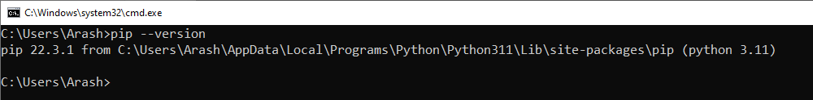
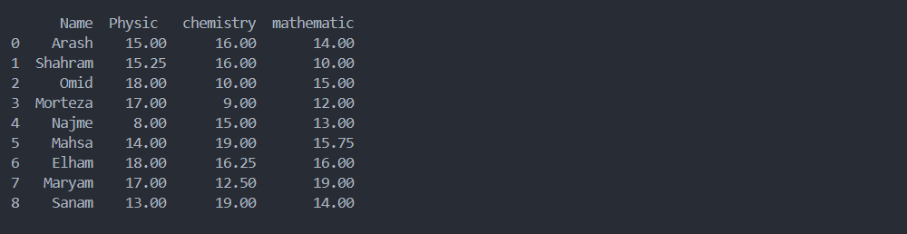
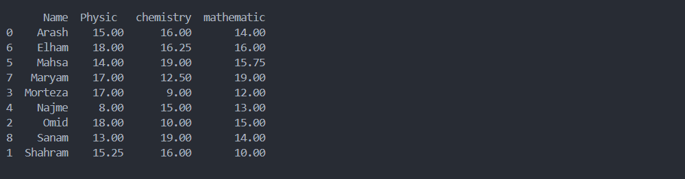

# فصل 1. معرفی Pandas

پانداس `Pandas` کتابخانه ای قدرتمند و متن باز برای زبان برنامه نویسی پایتون توسعه داده شده، کاربردهای پانداس به 2 دسته کلی می توان تقسیم کرد:

<ul dir="rtl">
	<li>
		<p>
			پیش پردازش <code>PreProcessing</code>
		</p>
		<p>
			پالایش ناهنجاری ها، مرتب سازی داده، استخراج داده های آماری
		</p>
	</li>
	<li>
		<p>
			مصور سازی <code>Visualization</code>
		</p>
		<p>
			نمایش داده ها در قالب انواع نمودار
		</p>
	</li>
</ul>

## نصب

برای نصب، باید نسخه pip بالاتر از pip>=19.3 باشد.

برای بررسی نسخه pip، دستور ذیل در محیط ترمینال وارد کنید.

```bash
pip --version
```



در صورتیکه نسخه pip شما کمتر از 19.3 بود، آخرین نسخه [پایتون](https://www.python.org/downloads/) نصب کنید.

پانداس نصب کنید.

```bash
pip install pandas
```

برای اطمینان از نسخه نصب شده، دستور ذیل در محیط برنامه نویسی پایتون وارد کنید.

```python
import pandas as pd
print(pd.__version__)
```

## پروژه دست گرمی 🧪

قصد داریم، نمرات دانشجویان به کمک کتابخانه Pandas، نمایش دهیم.

کتابخانه pandas به پروژه وارد می کنیم. ( معمولا از نام مستعار pd برای صدا زدن این کتابخانه استفاده می شود. )

```python
import pandas as pd
```

نمرات دانشجویان درون متغییر از نوع dict تعریف می کنیم.

> 💡 به مجموعه داده های آماری، که هدف بررسی ما می باشند، Data Set گفته می شود.

```python
import pandas as pd

dataSet = {
    "Name": [
        "Arash",
        "Shahram",
        "Omid",
        "Morteza",
        "Najme",
        "Mahsa",
        "Elham",
        "Maryam",
        "Sanam",
    ],
    "Physic ": [15, 15.25, 18, 17, 8, 14, 18, 17, 13],
    "chemistry": [16, 16, 10, 9, 15, 19, 16.25, 12.5, 19],
    "mathematic": [14, 10, 15, 12, 13, 15.75, 16, 19, 14],
}

df = pd.DataFrame(dataSet)
print(df)
```

متد DataFrame وظیفه تبدیل دیتاست به دیتافریم دارد.

> 👀 در اینده دیتافریم بیشتر توضیح داده میشه ولی برای آمادگی ذهنی، دیتافریم مثل جدول، از سطر و ستون تشکیل شده.



متد sort_values، جدول براساس ستون خاصی مرتب می کند. ستون براساس نام مرتب می کنیم.

```python
import pandas as pd

dataSet = {
    "Name": [
        "Arash",
        "Shahram",
        "Omid",
        "Morteza",
        "Najme",
        "Mahsa",
        "Elham",
        "Maryam",
        "Sanam",
    ],
    "Physic ": [15, 15.25, 18, 17, 8, 14, 18, 17, 13],
    "chemistry": [16, 16, 10, 9, 15, 19, 16.25, 12.5, 19],
    "mathematic": [14, 10, 15, 12, 13, 15.75, 16, 19, 14],
}

df = pd.DataFrame(dataSet)
df = df.sort_values(
    by=["Name"]
)  # you can use "inplace=True" Instead of reassign to variable in argument.
print(df)

```

> 💡 این متد به صورت پیش فرض، تغییرات به صورت موقت نگهداری می کند، به عبارت دیگر، اصل داده ای که در ورودی این متد تعریف شده، تغییر نمی کند، در نتیجه برای دسترسی به داده باید خروجی درون متغییر نگهداری کنیم.
>
> ```python
> df = df.sort_values(
>    by=["Name"]
> )
> ```
>
> برای نگهداری تغییرات به صورت دائمی، باید "inplace=True" درون آرگومان تعریف کنیم. در نتیجه اصل داده، با تغییرات جدید ( جدول مرتب شده ) باز نویسی می شود.
>
> ```diff
> - df = df.sort_values(
> -     by=["Name"]
> - )
> + df.sort_values(by=["Name"], inplace=True)
> ```
>



📁 [مشاهده پروژه](project/students.py)
