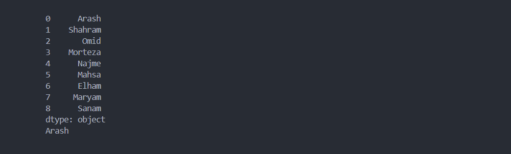
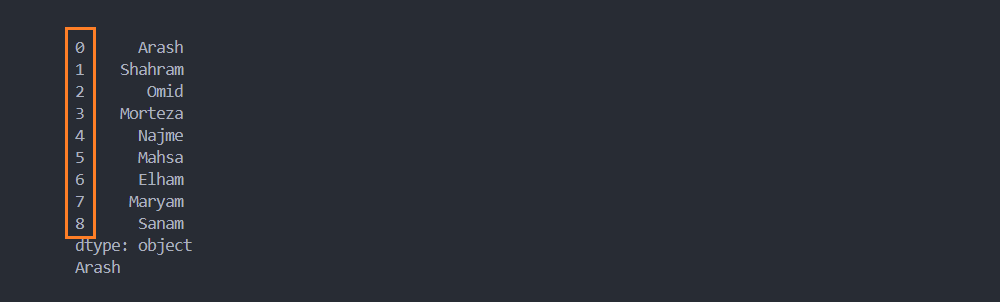
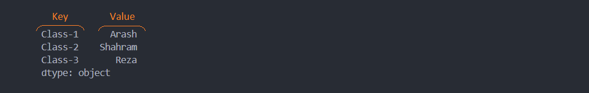
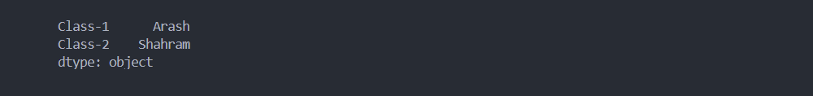
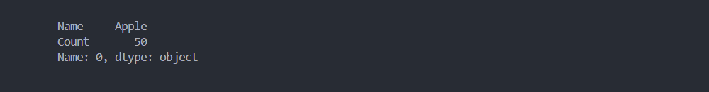
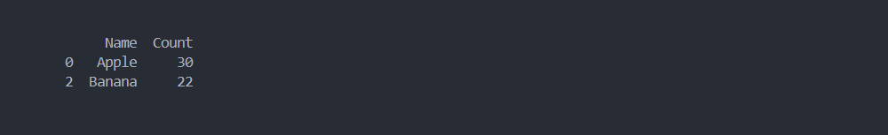
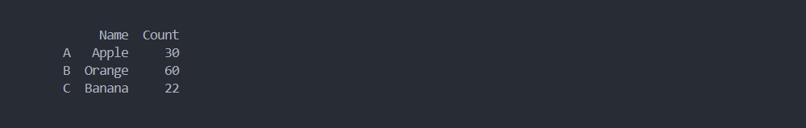
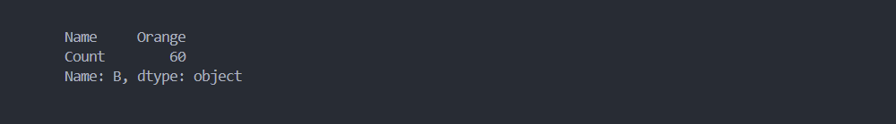

# فصل 2. ساختار دیتا

دیتا در pandas به 2 دسته تقسیم بندی می شوند:

* سری ( Series )
* دیتا فریم ( DataFrame )

## 1. سری ( Series ) 

به توالی داده ها، به صورت تک بعدی ( مانند یک ستون از جدول )، series گفته می شود.

```python
import pandas as pd

dataSet = [
    "Arash",
    "Shahram",
    "Omid",
    "Morteza",
    "Najme",
    "Mahsa",
    "Elham",
    "Maryam",
    "Sanam",
]

series = pd.Series(dataSet)
print(series)

```

سری ها تمام ویژگی لیست را دارد.

```python
import pandas as pd

dataSet = [
    "Arash",
    "Shahram",
    "Omid",
    "Morteza",
    "Najme",
    "Mahsa",
    "Elham",
    "Maryam",
    "Sanam",
]

series = pd.Series(dataSet)
print(series)
print(series[0])
```



📁 [مشاهده پروژه](project/1.accessing-element-series.py)

### تعریف لیبل ( Create Label )

به عدد متناظر هر سطر، که مقداری برابر با ایندکس دارد، label گفته می شود.



### شخصی سازی لیبل ( Custom Label )

برای تغییر مقادیر لیبل به هر مقدار دلخواهی کافیست، لیستی با **ترتیب مشخص** از نام لیبل ها، در آرگومان به پارامتر index مقدار دهی کنیم.

```python
import pandas as pd

dataSet = [
    "Arash",
    "Shahram",
    "Omid",
    "Morteza",
    "Najme",
    "Mahsa",
    "Elham",
    "Maryam",
    "Sanam",
]

series = pd.Series(dataSet, index=["a", "b", "c", "d", "e", "f", "g", "h", "y"])
print(series)
```

> 💡 دقت کنید طول لیست index باید با طول series برابر باشد.

با نام گذاری label، برای دسترسی به عنصر مشخصی از series، می توانیم **علاوه بر** شماره ایندکس از نام لیبل نیز استفاده کنیم.

````python
import pandas as pd

dataSet = [
    "Arash",
    "Shahram",
    "Omid",
    "Morteza",
    "Najme",
    "Mahsa",
    "Elham",
    "Maryam",
    "Sanam",
]

series = pd.Series(dataSet, index=["a", "b", "c", "d", "e", "f", "g", "h", "y"])
print(series)
print(series["b"], series[1]) # series["b"] = series[1]
````


📁 [مشاهده پروژه](project/2.accessing-element-series-by-label.py)

### ساخت سری با دیکشنری ( Dictionary as Series )

با مقدار دهی داده از نوع دیکشنری به سری، مقادیر key برابر با نام لیبل و مقادیر value برابر با داده در هر سطون تعریف می شود.

```python
import pandas as pd

dataSet = {"Class-1": "Arash", "Class-2": "Shahram", "Class-3": "Reza"}
series = pd.Series(dataSet)

print(series)
```



📁 [مشاهده پروژه](project/3.dictionary-as-series.py)

### فیلتر سری های که با دیکشنری مقدار دهی شده ( Filter Series Based on Dict )

برای فیلتر کردن سری، به label های خاص، کافیست لیستی به **ترتیب مشخص** از نام لیبل های موردنظر را در آرگومان به ایندکس مقدار دهی کنیم.

```python
import pandas as pd

dataSet = {"Class-1": "Arash", "Class-2": "Shahram", "Class-3": "Reza"}
series = pd.Series(dataSet, index=["Class-1", "Class-2"])

print(series)
```



دقت کنید که "class-3" در خروجی نمایش داده نشده.

> 💡 دقت کنید، که عملکرد پارامتر index، به نوع داده وابسته می باشد:
>
> * اگر داده از نوع لیست باشد، index مقدار label تغییر می دهد.
> * اگر داده از نوع دیکشنری باشد، index عمل فیلتر انجام می دهد.

## 2. دیتا فریم ( DataFrame )

به مجموعه داده چند بعدی که شامل سطر و ستون می باشد ( مانند جدول )، DataFrame گفته می شود.

> سری ها تک بعدی هستند.

```python
import pandas as pd

data = {"Name": ["Apple", "Orange"], "Count": [50, 40]}
df = pd.DataFrame(data)

print(df)
```


### متد loc

این متد، سطر های مشخصی از یک dataFrame برگشت می دهد. مثال ذیل سطر اول برگشت می دهد.

```python
import pandas as pd

data = {"Name": ["Apple", "Orange"], "Count": [50, 40]}
df = pd.DataFrame(data)

print(df.loc[0])
```



می توانیم به متد loc لیستی از شماره سطرهای مشخص شده، ارسال کنیم. در این مثال سطر اول و دوم نمایش داده می شود.

```python
import pandas as pd

data = {"Name": ["Apple", "Orange", "Banana"], "Count": [30, 60, 22]}

df = pd.DataFrame(data)
print(df.loc[[0, 2]])
```



### شخصی سازی لیبل ( Custom Label )

برای تغییر مقادیر لیبل، به هر مقدار دلخواه، کافیست، لیستی با **ترتیب مشخص** از نام label ها، در آرگومان به index مقدار دهی کنیم.

```python
import pandas as pd

data = {"Name": ["Apple", "Orange", "Banana"], "Count": [30, 60, 22]}

df = pd.DataFrame(data, index=["A", "B", "C"])
print(df)
```



> 💡 دقت کنید طول لیست ایندکس باید با طول Value ها برابر باشد.

با نام گذاری لیبل، برای دسترسی به سطر مشخصی از dataFrame، می توانیم **علاوه بر** شماره ایندکس از نام لیبل استفاده کنیم.

```python
import pandas as pd

data = {"Name": ["Apple", "Orange", "Banana"], "Count": [30, 60, 22]}
df = pd.DataFrame(data, index=["A", "B", "C"])

print(df.loc["B"])
```




------

👋 Hi, I’m Arash Yeganeh.

How can you best ❤️ **Support me** ❤️  :

- Give me  [GitHub Stars ⭐](https://github.com/arashyeganeh) 
- Share my content to someone else 👀
- Follow me on [linkedin](https://www.linkedin.com/in/arash-yeganeh)
- Subscribe my [YouTube](https://www.youtube.com/channel/UCUuojnAmPiklBpAeBmHE4Aw) channel
