# فصل 2. ساختارهای داده `Data structures`

## انواع داده ها در Pandas

در Pandas داده ها به دو نوع تقسیم بندی می شوند:

* سری `Series `
* دیتافریم `DataFrame`

### 1. سری `Series`

```python
Series(data=None, index=None, dtype=None, name=None, copy=False, fastpath=False)
```


به توالی داده ها به صورت **1 بعدی**، Series گفته می شود.

**تعریف سری با انواع آرایه**

متد `()Series` وظیفه تبدیل ارایه ای از داده به Series دارد. این آرایه می تواند tuple, list, dict باشد.

> 💡 دقت کنید، به دلیل غیر ترتیبی `unordered` بودن set نمی توانید به صورت مستقیم به سری تبدیل کنید.

```python
import pandas as pd

dataSet = [
    "Arash",
    "Shahram",
    "Omid",
    "Morteza",
    "Najme",
    "Mahsa",
    "Elham",
    "Maryam",
    "Sanam",
]

series = pd.Series(dataSet)
print(series)
```

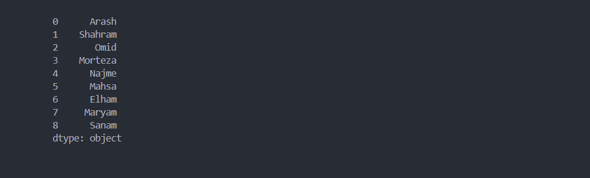

#### 1. لیست `List`

```python
import pandas as pd

dataSet_list = [
    "Arash",
    "Shahram",
    "Omid"
]

series = pd.Series(dataSet_list)
```

#### 2. تاپل `Tuple`

```python
import pandas as pd

dataSet_tuple = (
    "Arash",
    "Shahram",
    "Omid"
)

series = pd.Series(dataSet_tuple)
```

#### 3. ست `Set`

به دلیل غیر ترتیبی `unordered` بودن set نمی توانید به صورت مستقیم به سری تبدیل کنید، برای اینکار ابتدا باید به نوع دیگری از داده تبدیل کنید، بعد به series تبدیل کنید.

> 💀 دقت کنید، داده هایی که از نوع set می باشند به دلیل عدم حفظ ترتیب عناصر، ترتیب خروجی در هر بار اجرای برنامه متفاوت می باشد. 

```python
import pandas as pd

dataSet_set = {
    "Arash",
    "Shahram",
    "Omid"
}

print(type(dataSet_set))
dataSet_list = list(dataSet_set)

print(type(dataSet_list))
series = pd.Series(dataSet_list)

print(series)
```

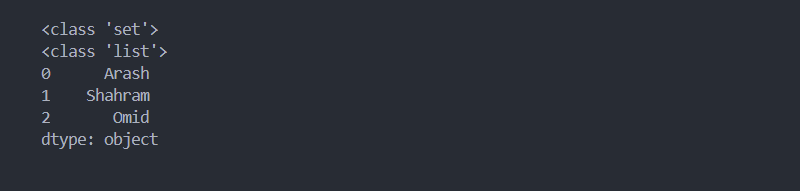

#### 4. رشته `String`

رشته بعد از تبدیل به سری، به صورت سری با یک عضو تبدیل می شود.

```python
import pandas as pd

dataSet_str = "Arash Shahram Omid"
series = pd.Series(dataSet_str)
print(series)
```

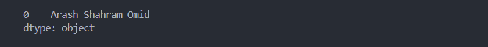

برای استخراج قسمت هایی از رشته که با فضای خالی از هم جدا شده اند از متد `()split` استفاده می کنیم.

```python
import pandas as pd

dataSet_str = "Arash Shahram Omid"
dataSet_list = dataSet_str.split(" ")

series = pd.Series(dataSet_list)
print(series)
```

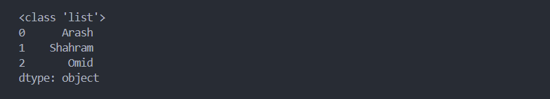

#### 5. دیکشنری `Dict`

ساختار داده های از نوع دیکشنری به صورت `key:value`  می باشد؛ به عبارت دیگر تک بعدی نیست.

```python
import pandas as pd

dataSet_dict = {"Label-1": "Arash", "Label-2": "Shahram", "Label-3": "Omid"}
series = pd.Series(dataSet_dict)

print(series)
```


به ستون اول دقت کنید، این مقادیر با سایر ارایه های تک بعدی مقایسه کنید!

در ارایه های تک بعدی ستون اول برابر مقدار Index هر عضو می باشد ولی در ساختار `key:value` برابر مقدار `key` می باشد.

> 💡 به ستون اول لیبل `label` گفته می شود.

### 2. دیتافریم `DataFrame`

```python
DataFrame(data=None, index=None, columns=None, dtype=None, copy=None)
```

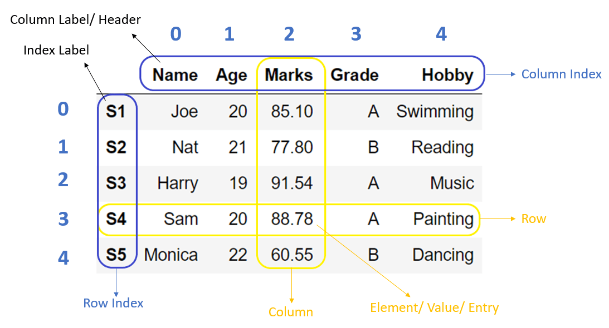

به توالی داده ها به صورت **2 بعدی**، DataFrame گفته می شود. به عبارت دیگر، از کنار هم قرار گیری چند سری `series` ، دیتافریم تشکیل می شود.

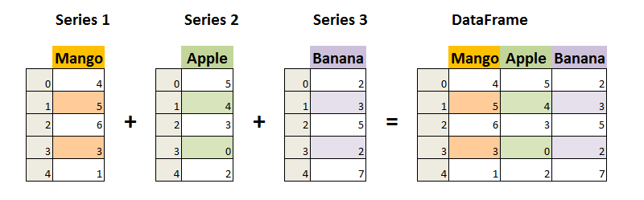

**تعریف سری با انواع آرایه**

متد `()DataFrame` وظیفه تبدیل ارایه ای از داده به DataFrame دارد. این آرایه می تواند set ,tuple, list, dict باشد.

> 💡 دقت کنید، برخلاف series می توانیم از set استفاده کنیم.

```python
import pandas as pd

data = {"Name": ["Apple", "Orange"], "Count": [50, 40]}
df = pd.DataFrame(data)

print(df)
```


> 💡 با توجه به اینکه دیتافریم ساختار 2 بعدی دارد، ولی می توانیم انواع ارایه به صورت تک بعدی نیز وارد کنیم.
>
> ```python
> import pandas as pd
> 
> data = ["Arash", "Shahram", "Omid"]
> df = pd.DataFrame(data)
> 
> print(df)
> ```
>
> 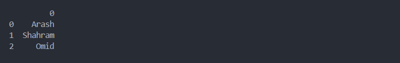

#### 1. لیست `List`

```python
import pandas as pd

data = [["Name", "Count"], ["Apple", "50"], ["Orange", "40"]]
df = pd.DataFrame(data)

print(df)
```

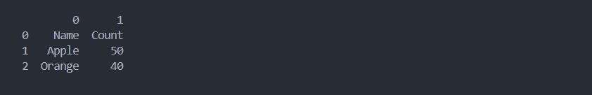

#### 2. تاپل `Tuple`

```python
import pandas as pd

data = (("Name", "Count"), ("Apple", "50"), ("Orange", "40"))
df = pd.DataFrame(data)

print(df)
```

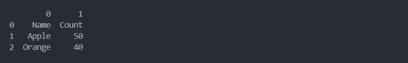

#### 3. ست `Set`

ست به عنوان دسته ریشه **نمی توانیم** استفاده کنیم.

```
❌ {{"Name", "Count"}, {"Apple", "50"}, {"Orange", "40"}}
✔️ [{"Name", "Count"}, {"Apple", "50"}, {"Orange", "40"}]
✔️ ({"Name", "Count"}, {"Apple", "50"}, {"Orange", "40"})
```

> 💀 دقت کنید، داده هایی که از نوع set می باشند به دلیل عدم حفظ ترتیب عناصر، ترتیب خروجی در هر بار اجرای برنامه متفاوت می باشد. 

```python
import pandas as pd

data = [{"Name", "Count"}, {"Apple", "50"}, {"Orange", "40"}]
df = pd.DataFrame(data)

print(df)
```

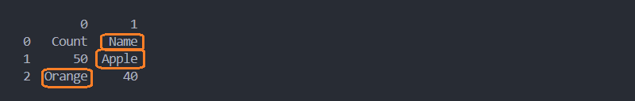

#### 4. دیکشنری `Dict`

به دلیل ساختار 2 بعدی که دیتافریم دارد دیکشنری مناسب ترین data type می باشد.

```python
import pandas as pd

data = {"Name": ["Apple", "Orange"], "Count": [50, 40]}
df = pd.DataFrame(data)

print(df)
```

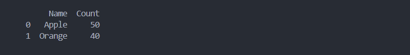

سایر الگوی نوشتاری دیکشنری

```python
[
    {
        "Name": "Apple",
        "Count": 50
    },
    {
        "Name": "Orange",
        "Count": 40
    }
]
```

## لیبل `Label`

به نام بخش مشخصی از داده که صفات وابسته به هم دارند لیبل `Label` گفته می شود. به صورت پیش فرض مقدار لیبل برابر با شماره Index می باشد.

### 1. سری `Series`

در سری هر **ایتم** دارای لیبل جداگانه می باشد که به صورت پیش فرض برابر با شماره index آن ایتم می باشد.

```python
import pandas as pd

dataSet = [
    "Arash",
    "Shahram",
    "Omid",
    "Morteza",
    "Najme",
    "Mahsa",
    "Elham",
    "Maryam",
    "Sanam",
]

series = pd.Series(dataSet)
print(series)
```

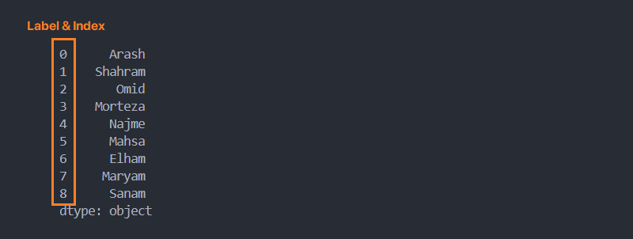

#### شخصی سازی لیبل `Label`

##### روش اول: استفاده از پارامتر index

برای تغییر نام لیبل ها کافیست ارایه ای:

* با طول برابر با تعداد اعضای سری
* رعایت نامگذاری هر ایتم

به پارامتر index نسبت دهیم.

```python
import pandas as pd

dataSet = [
    "Arash",
    "Shahram",
    "Omid",
    "Morteza",
    "Najme",
    "Mahsa",
    "Elham",
    "Maryam",
    "Sanam",
]

series = pd.Series(dataSet, index=["a", "b", "c", "d", "e", "f", "g", "h", "y"])
print(series)
```

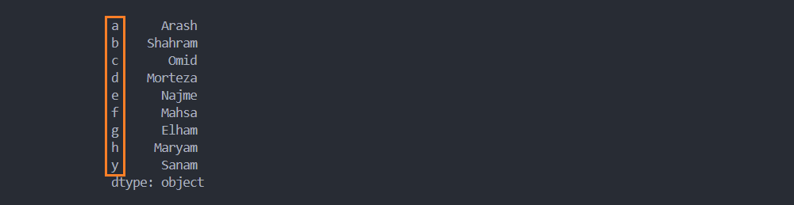

برای دسترسی به ایتم مشخصی از سری، امکان فراخوانی با نام لیبل ممکن می باشد.

```python
series["b"]
```

> 💡 دقت کنید، با تغییر نامگذاری لیبل ها، امکان دسترسی به ایتم های سری همچنان با شماره index امکان پذیر می باشد.
>
> ```python
> series[1]
> ```

```
import pandas as pd

dataSet = [
    "Arash",
    "Shahram",
    "Omid",
    "Morteza",
    "Najme",
    "Mahsa",
    "Elham",
    "Maryam",
    "Sanam",
]

series = pd.Series(dataSet, index=["a", "b", "c", "d", "e", "f", "g", "h", "y"])
print(series)
print(series["b"], series[1]) # series["b"] = series[1]
```

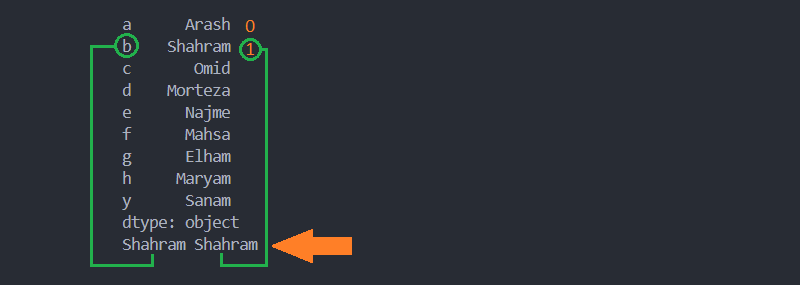

##### روش دوم: تبدیل دیکشنری به سری

اگر داده دیکشنری به سری تبدیل کنیم مقدار key برابر با نام لیبل می شود.

```python
import pandas as pd

dataSet_dict = {"Label-1": "Arash", "Label-2": "Shahram", "Label-3": "Omid"}
series = pd.Series(dataSet_dict)

print(series)
```


> 💡 در این روش، پارامتر index نقش فیلتر کردن لیبل ها را ایفا می کند. یعنی فقط لیبل های تعریف شده در index خروجی تعریف می شوند.
>
> ```python
> import pandas as pd
> 
> dataSet_dict = {"Label-1": "Arash", "Label-2": "Shahram", "Label-3": "Omid"}
> index = ["Label-1"]
> series = pd.Series(dataSet_dict, index=index)
> 
> print(series)
> ```
>
> 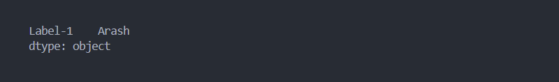
>
> به خروجی دقت کنید، مقادیر "Label-2" و "Label-3" حذف شده.

### 2. دیتافریم `DataFrame`

در دیتافریم هر **سطر** دارای لیبل جداگانه می باشد که به صورت پیش فرض برابر با شماره index آن سطر می باشد.

```python
import pandas as pd

data = {"Name": ["Apple", "Orange"], "Count": [50, 40]}
df = pd.DataFrame(data)

print(df)
```

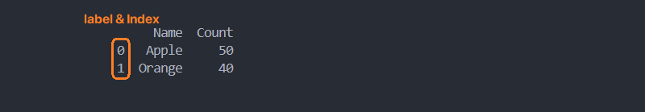

#### شخصی سازی لیبل `Label`

برای تغییر نام لیبل ها کافیست ارایه ای:

* با طول برابر با تعداد اعضای value ها
* رعایت نامگذاری هر ایتم

به پارامتر index نسبت دهیم.

```python
import pandas as pd

data = {"Name": ["Apple", "Orange"], "Count": [50, 40]}
index = ["fruit-1", "fruit-2"]
df = pd.DataFrame(data, index=index)

print(df)
```

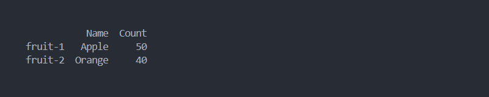
