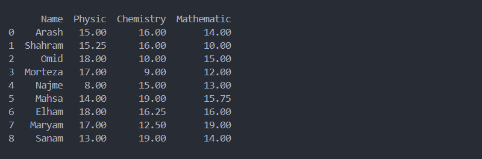
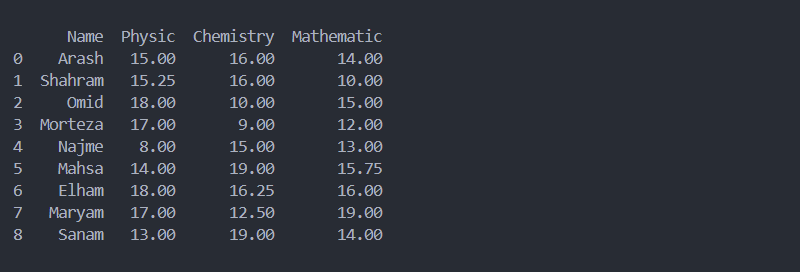
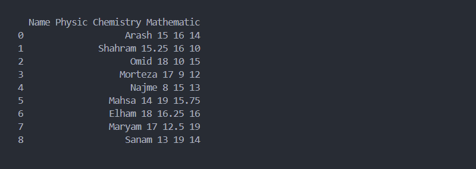
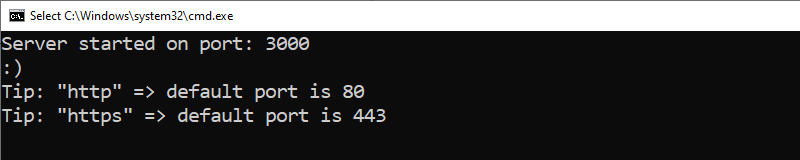
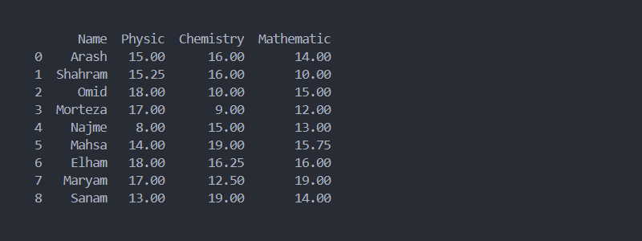
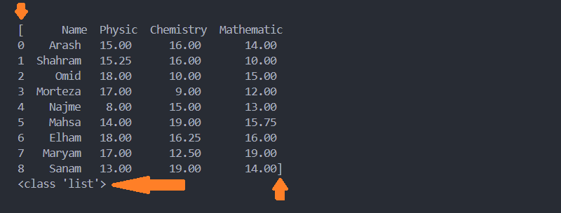
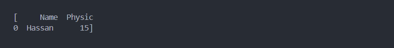
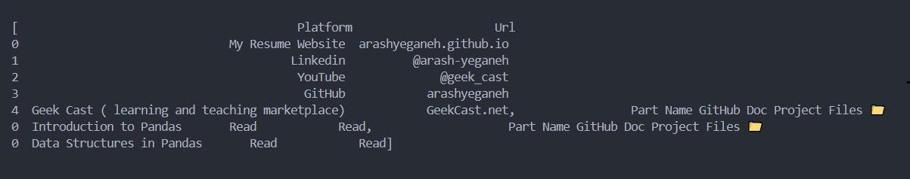

# فصل 3. وارد کردن اطلاعات `Data Importing`

اولین مرحله برای آنالیز داده، جمع آوری داده می باشد. به سه روش اطلاعات می توانیم جمع آوری کنیم.

* افلاین: روش سنتی برای تحلیل داده به صورت افلاین بوده که داده های برای بازه زمانی جمع آوری می شده و سپس مورد بررسی قرار می گرفته ( batch learning method ). در این روش داده ها به صورت فایل به مهندسین داده کاوی تحویل داده می شد.
* آنلاین: امروزه به کمک این روش داده ها به صورت Real Time مورد بررسی قرار می گیرد برای مثال شبکه تاکسیرانی در نظر بگیرید، بارش برف باعث تغییر تعرفه ها و تغییر مسیرهای پیشنهادی می شود. این روش مهندسین داده کاوی دسترسی مستقیم به دیتابیس یا داده هایی که سیستم های واسط تحت رابط API در اختیار مهندسین داده کاوی قرار می دهند.

**دیتاست `Dataset` چیست؟**

به مجموعه داده ای که هدف اصلی بررسی و داده کاوی می باشد دیتاست گفته می شود.

## فایل `File`

از محدودیت های این روش، می توانیم به عدم بروزرسانی لحظه ای داده اشاره کرد.

### 1. فایل XML

ساختار XML ( Extensible Markup Language )، به منظور ذخیره سازی داده و انتقال داده بین سیستم ها، بدون هرگونه وابستگی نرم افزاری طراحی شده است. متداول کاربرد XML:

* کدهای HTML از ساختار XML پیروی می کنند.
* رابط `API` نوع SOAP از ساختار XML استفاده می کند.

در این مثال ساختار XML در قالب فایل بررسی می کنیم.

نمونه کد XML 👇

```xml
<?xml version="1.0" encoding="UTF-8"?>
<root>
    <row>
        <Name>Arash</Name>
        <Physic>15</Physic>
        <Chemistry>16</Chemistry>
        <Mathematic>14</Mathematic>
    </row>
    <row>
        <Name>Shahram</Name>
        <Physic>15.25</Physic>
        <Chemistry>16</Chemistry>
        <Mathematic>10</Mathematic>
    </row>
    <row>
        <Name>Omid</Name>
        <Physic>18</Physic>
        <Chemistry>10</Chemistry>
        <Mathematic>15</Mathematic>
    </row>
    <row>
        <Name>Morteza</Name>
        <Physic>17</Physic>
        <Chemistry>9</Chemistry>
        <Mathematic>12</Mathematic>
    </row>
    <row>
        <Name>Najme</Name>
        <Physic>8</Physic>
        <Chemistry>15</Chemistry>
        <Mathematic>13</Mathematic>
    </row>
    <row>
        <Name>Mahsa</Name>
        <Physic>14</Physic>
        <Chemistry>19</Chemistry>
        <Mathematic>15.75</Mathematic>
    </row>
    <row>
        <Name>Elham</Name>
        <Physic>18</Physic>
        <Chemistry>16.25</Chemistry>
        <Mathematic>16</Mathematic>
    </row>
    <row>
        <Name>Maryam</Name>
        <Physic>17</Physic>
        <Chemistry>12.5</Chemistry>
        <Mathematic>19</Mathematic>
    </row>
    <row>
        <Name>Sanam</Name>
        <Physic>13</Physic>
        <Chemistry>19</Chemistry>
        <Mathematic>14</Mathematic>
    </row>
</root>
```

متد `()read_xml` وظیفه تبدیل فایل xml به data frame دارد.

> 💡 دقت کنید، برای استفاده از متد `()read_xml` نیاز به نصب کتابخانه `lxml` دارید.
>
> ```bash
> pip install lxml
> ```

```python
import pandas as pd

try:
    df = pd.read_xml("dataset.xml")
    print(df)

except Exception as err:
    print(err)
```



📁 [مشاهده پروژه](project/xml.py)

### 2. فایل JSON

ساختار JSON ( JavaScript Object Notation )، مانند XML به منظور ذخیره و انتقال داده بین سیستم ها، بدون وابستگی نرم افزاری طراحی شده است. متداول ترین کاربرد JSON:

* رابط `API` نوع Rest از ساختار JSON استفاده می کند.
* بیشتر برای ارتباط بین سرور و کلاینت استفاده می شود.

نمونه کد JSON 👇

```json
[
  {
    "Name": "Arash",
    "Physic": 15,
    "Chemistry": 16,
    "Mathematic": 14
  },
  {
    "Name": "Shahram",
    "Physic": 15.25,
    "Chemistry": 16,
    "Mathematic": 10
  },
  {
    "Name": "Omid",
    "Physic": 18,
    "Chemistry": 10,
    "Mathematic": 15
  },
  {
    "Name": "Morteza",
    "Physic": 17,
    "Chemistry": 9,
    "Mathematic": 12
  },
  {
    "Name": "Najme",
    "Physic": 8,
    "Chemistry": 15,
    "Mathematic": 13
  },
  {
    "Name": "Mahsa",
    "Physic": 14,
    "Chemistry": 19,
    "Mathematic": 15.75
  },
  {
    "Name": "Elham",
    "Physic": 18,
    "Chemistry": 16.25,
    "Mathematic": 16
  },
  {
    "Name": "Maryam",
    "Physic": 17,
    "Chemistry": 12.5,
    "Mathematic": 19
  },
  {
    "Name": "Sanam",
    "Physic": 13,
    "Chemistry": 19,
    "Mathematic": 14
  }
]
```

متد `()read_json ` وظیفه تبدیل فایل json به data frame دارد.

```python
import pandas as pd

try:
    df = pd.read_json('dataset.json')
    print(df)

except Exception as err:
    print(err)
```



📁 [مشاهده پروژه](project/json.py)

### 3. فایل Excel

محبوب ترین فایل از مجموعه آفیس مایکروسافت می باشد.

> 💡 دقت کنید، برای استفاده از متد `()read_excel ` نیاز به نصب کتابخانه `openpyxl` دارید.
>
> ```shell
> pip install openpyxl
> ```

متد `()read_excel ` وظیفه تبدیل فایل excel به data frame دارد.

```python
import pandas as pd

try:
    df = pd.read_excel('dataset.xlsx')
    print(df)

except Exception as err:
    print(err)
```


📁 [مشاهده پروژه](project/excel.py)

### 4. فایل CSV

فایل ( Comma Separated Values ) CSV، در این فایل هر داده از دیگری با کاما "," از هم جدا شده و دارای ساختار plain text می باشد.

نمونه کد CSV 👇

```
Name,Physic,Chemistry,Mathematic
Arash,15,16,14
Shahram,15.25,16,10
Omid,18,10,15
Morteza,17,9,12
Najme,8,15,13
Mahsa,14,19,15.75
Elham,18,16.25,16
Maryam,17,12.5,19
Sanam,13,19,14
```

متد `()read_csv ` وظیفه تبدیل فایل csv به data frame دارد.

```python
import pandas as pd

try:
    df = pd.read_csv('dataset.csv')
    print(df)

except Exception as err:
    print(err)
```


📁 [مشاهده پروژه](project/csv.py)

> 💡 به جای متد `()read_csv `، از متد `()read_table` می توان استفاده کرد.
>
> دقت کنید، در فایل CSV هر داده با دیگری با کاراکتر کاما "," از هم جدا شده، در نتیجه برای استفاده از متد `()read_table` باید معیار جداسازی هر داده به کاراکتر کاما "," تغییر بدهیم. برای اینکار  از پارامتر sep استفاده می کنیم.
>
> ```python
> import pandas as pd
> 
> try:
>  df = pd.read_table('dataset.csv', sep=",") # sep=","
>  print(df)
> 
> except Exception as err:
>  print(err)
> ```

### 5. فایل TXT

فایل TXT، فرمت نگهداری ساده متن به صورت plain text می باشد.

نمونه کد TXT 👇

```
Name Physic Chemistry Mathematic
Arash 15 16 14
Shahram 15.25 16 10
Omid 18 10 15
Morteza 17 9 12
Najme 8 15 13
Mahsa 14 19 15.75
Elham 18 16.25 16
Maryam 17 12.5 19
Sanam 13 19 14
```

متد `()read_table ` وظیفه تبدیل فایل txt به data frame دارد.

```python
import pandas as pd

try:
    df = pd.read_table('dataset.txt')
    print(df)

except Exception as err:
    print(err)
```



📁 [مشاهده پروژه](project/txt.py)

> 💡 به جای متد `()read_table `، از متد `()read_csv ` می توان استفاده کرد.
>
> دقت کنید که در CSV هر داده با دیگری با کاراکتر کاما "," از هم جدا شده است، در نتیجه برای خواندن dataset که به صورت txt ذخیره شده، باید معیار جدا سازی هر داده به space تغییر بدهیم. برای اینکار  از پارامتر sep استفاده می کنیم.
>
> ```python
> import pandas as pd
> 
> try:
>  df = pd.read_csv('dataset.txt', sep=" ") # --> sep=" "
>  print(df)
> 
> except Exception as err:
>  print(err)
> ```

## وب سرور `Web Server`

###  1. ارتباط REST

ارتباط REST بر مبنای json ، برای ارتباط کلاینت با سرور طراحی شده است. فایل `server.js` در پوشه `project` شبیه ساز سرور REST می باشد.

>  برای اجرای فایل `server.js` نیاز به نصب NodeJs روی سیستم دارید. [لینک دانلود NodeJs](https://nodejs.org/en/download/)

بعد از نصب `NodeJs` فایل `server-run.bat` اجرا کنید.



سرور روی پورت `3000` فعال می باشد.

```python
import requests
import json
import pandas as pd

try:
    # Senario 1 👇
    response = requests.get("http://localhost:3000")
    # "http://127.0.0.1:3000" = "http://localhost:3000"

    if response.status_code == 200:
        data_json = response.json()
        data_json = json.dumps(data_json)
        df = pd.read_json(data_json)
        print(df)

    # Senario 2 👇
    # df = pd.read_json("http://localhost:3000")  # Or "http://127.0.0.1:3000"
    # print(df)


except Exception as err:
    print(err)
```



📁 [مشاهده پروژه](project/rest)

### 2. ساختار HTML

فایل HTML ( Hyper Text Markup Language )، زبان استاندارد صفحات وب می باشد که بر مبنای ساختار XML طراحی شده است.

نمونه کد HTML 👇

```html
<!DOCTYPE html>
<html lang="en">
  <body>
    <table>
      <thead>
        <tr>
          <td>Name</td>
          <td>Physic</td>
          <td>Chemistry</td>
          <td>Mathematic</td>
        </tr>
      </thead>
      <tr>
        <td>Arash</td>
        <td>15</td>
        <td>16</td>
        <td>14</td>
      </tr>
      <tr>
        <td>Shahram</td>
        <td>15.25</td>
        <td>16</td>
        <td>10</td>
      </tr>
      <tr>
        <td>Omid</td>
        <td>18</td>
        <td>10</td>
        <td>15</td>
      </tr>
      <tr>
        <td>Morteza</td>
        <td>17</td>
        <td>9</td>
        <td>12</td>
      </tr>
      <tr>
        <td>Najme</td>
        <td>8</td>
        <td>15</td>
        <td>13</td>
      </tr>
      <tr>
        <td>Mahsa</td>
        <td>14</td>
        <td>19</td>
        <td>15.75</td>
      </tr>
      <tr>
        <td>Elham</td>
        <td>18</td>
        <td>16.25</td>
        <td>16</td>
      </tr>
      <tr>
        <td>Maryam</td>
        <td>17</td>
        <td>12.5</td>
        <td>19</td>
      </tr>
      <tr>
        <td>Sanam</td>
        <td>13</td>
        <td>19</td>
        <td>14</td>
      </tr>
      <tr>
        <td></td>
      </tr>
    </table>
  </body>
</html>
```

> 💡 دقت کنید، برای استفاده از متد read_html نیاز به نصب کتابخانه های "html5lib" و "BeautifulSoup4" دارید.
>
> ```shell
> pip install html5lib BeautifulSoup4
> ```

متد read_html وظیفه تبدیل فایل csv به data frame دارد.

> 💡 دقت کنید، این متد تمام جدول های موجود در فایل html به صورت یک لیست برگشت می دهد.



📁 [مشاهده پروژه](project/html/single_tables)

برای انتخاب جدول مشخصی باید از پارامتر `match` استفاده کنید. این پارامتر مقدار `regex` دریافت می کند و هر جدولی که شامل این الگو شود انتخاب می کند.

مثال: انتخاب جدولی که شامل نمره حسن می باشد.

```python
import pandas as pd

try:
    li = pd.read_html("multiple_tables.html", match="Hassan")
    print(li)

except Exception as err:
    print(err)
```



📁 [مشاهده پروژه](project/html/multiple_tables)

متد `()read_html` توانایی خواندن صفحات وب به صورت مستقیم دارد.

```python
import pandas as pd

try:
    li = pd.read_html(
        "https://github.com/arashyeganeh/Pandas-Tutorial-Persian")
    print(li)

except Exception as err:
    print(err)
```



📁 [مشاهده پروژه](project/html/http)

## دیتابیس `DataBase`

انواع دیتابیس را براساس ساختار نگهداری داده به 3 دسته تقسیم بندی می شوند:

* SQL `oldSQL` `RDBMS`

  MySQL, Oracle, SQL Server

* New SQL

  VoltDB, CockroachDB

* No SQL

  MongoDB, Redis, Cassandra

### ساختار `SQL`

#### 1. دیتابیس `SQLite`

این دیتابیس کم حجم و پورتابل بوده که بیشتر در اپلیکیشن های اندروید استفاده می شود.

برای اتصال از کتابخانه `sqlite3` استفاده می کنیم.

```python
import sqlite3
import pandas as pd

try:
    db_connection = sqlite3.connect("dataset.db")
    df = pd.read_sql(
        'SELECT * FROM classroom', db_connection)

    print(df)

except Exception as err:
    print(err)
```


📁 [مشاهده پروژه](project/sqlite.py)

#### 2. دیتابیس `MySQL`

برای اتصال از کتابخانه `mysql` استفاده می کنیم.

```python
import mysql.connector as sql
import pandas as pd

db_connection = sql.connect(
    host='127.0.0.1', database='mock', user='arash', password='xx123456')

db_cursor = db_connection.cursor()
db_cursor.execute('SELECT * FROM classroom')

table_rows = db_cursor.fetchall()
df = pd.DataFrame(table_rows)

print(df)
```

📁 [مشاهده پروژه](project/mysql.py)

### ساختار `No SQL`

#### MongoDB

دیتابیس مانگو یکی از معروف ترین دیتابیس های غیر رابطه ای می باشد. برای اتصال به این دیتابیس از کتابخانه `pymongo` استفاده می کنیم.

```bash
pip install pymongo
```

```python
from pymongo import MongoClient
import pandas as pd

mongodb_uri = 'mongodb://127.0.0.1:27017'
mongodb_client = MongoClient(mongodb_uri)

db = mongodb_client["mock"]
collection = db["classroom"]

data = collection.find({}, {"_id": 0})
df = pd.DataFrame(data)

print(df)
```

📁 [مشاهده پروژه](project/mongodb.py)
