# فصل 4. آمار `Statistics`

اولین قدم در داده کاوی، تجزیه و تحلیل داده ها می باشد،  در این مرحله چند سوال باید پرسیده شود:

* داده ها از چه نوعی می باشند؟ ( عددی، رشته و ... )
* چه بخش هایی فاقد اهمیت می باشند؟
* آیا قسمت های با ارزش داده، حاوی سلول های خالی یا داده های غیر قابل درک می باشد؟
* چه مقدار از داده قابل اطمینان می باشد؟

با پاسخ به این سوالات به اهمیت این فصل پی خواهید برد.

## متد `()head`

```python
head(n=5)
```

تعداد سطر های مشخصی از **ابتدای** دیتافریم یا سری برگشت می دهد. به صورت پیش فرض **5** سطر ابتدایی برگشت می دهد.

> 💡 دقت کنید، شمارش سطرها از عدد **صفر** شروع می شود.

```python
import pandas as pd

try:
    df = pd.read_csv('dataset.csv')
    df_head = df.head(2)
    print(df_head)

except Exception as err:
    print(err)
```

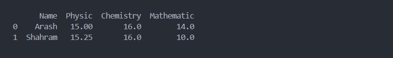

📁 [مشاهده پروژه](project/head.py)

## متد `()tail`

```python
tail(n=5)
```

تعداد سطرهای مشخصی از **انتهای**  دیتافریم یا سری برگشت می دهد. به صورت پیش فرض **5** سطر انتهایی برگشت می دهد.

```python
import pandas as pd

try:
    df = pd.read_csv('dataset.csv')
    df_tail = df.tail(2)
    print(df_tail)

except Exception as err:
    print(err)
```

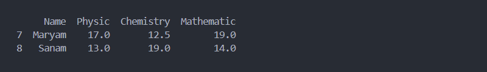

📁 [مشاهده پروژه](project/tail.py)

## متد `()info`

```python
info(verbose=None, buf=None, max_cols=None, memory_usage=None, show_counts=None, null_counts=None)
```

ساختار کلی دیتافریم / سری بررسی می کند و اطلاعات ذیل بیان می کند: ( متناسب با شماره مشخص شده در تصویر )

1. جنس داده
2. تعداد سطر ( تعداد ایندکس ) و بازه ایندکس
3. تعداد ستون
4. نام ستون ها
5. **تعداد سطرهای حاوی اطلاعات** ( تعداد سطرهایی که برابر null **نیست**. Non- Null count )
6. جنس هر ستون
7. جنس همه ستون ها
8. مقدار رم استفاده شده

```python
import pandas as pd

try:
    df = pd.read_csv('dataset.csv')
    df_info = df.info()
    print(df_info)

except Exception as err:
    print(err)
```

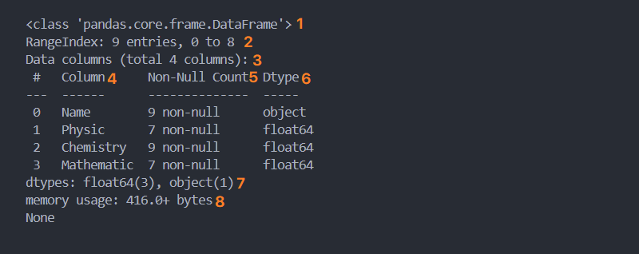

📁 [مشاهده پروژه](project/info.py)

## متد `()describe`

```python
describe(percentiles=None, include=None, exclude=None, datetime_is_numeric=False)
```

داده های هر ستون `Label` بر مبنای تعداد عنصر، میانگین، انحراف از معیار، کم ترین مقدار، بیشترین مقدار و صدک `Percentile ` بررسی می کند.

> ⚠️ دقت کنید، متد`()describe` فقط ستون هایی که حاوی مقادیر عددی می باشند، بررسی می کند.

* پارامتر **count**

  تعداد سطر های غیر خالی `Non-Null`

* پارامتر **mean** 

  میانگین ستون

* پارامتر **std** 

  انحراف از معیار ستون

* پارامتر **min** 

  کوچکترین مقدار

* پارامتر **25%** 

  مقدار صدک برابر 25%

* پارامتر **50%** 

  مقدار صدک برابر 50%

* پارامتر **75%**

  مقدار صدک برابر 75%

* پارامتر **max** 

  بزرگترین مقدار

به دلیل عدم پشتیبانی از داده های غیر عددی، ستون Name در خروجی نمایش داده نمی شود.

```python
import pandas as pd

try:
    df = pd.read_csv('dataset.csv')
    print(df.describe())

except Exception as err:
    print(err)
```

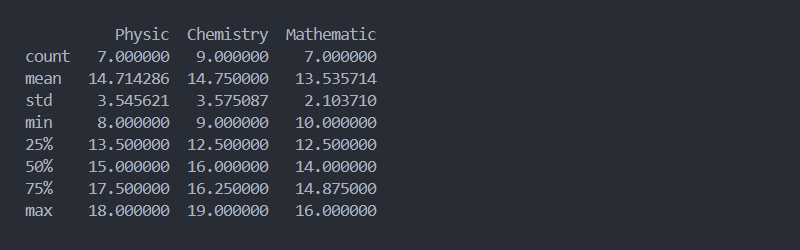

📁 [مشاهده پروژه](project/describe.py)

### صدک `Percentile `

صدک با کاراکتر `p` نمایش داده می شود. صدک عددی بین صفر و یک می باشد و بیانگر تراکم داده در بازه ای مشخص می باشد.

📚 مثال: صدک 25% از داده ای برابر است با 13.50 => این جمله به این معناست که 25% از داده ها مقداری **برابر یا کوچکتر** از 13.50 دارند.


برای محاسبه سایر مقادیر صدک، مقادیر مورد نظر در قالب ارایه به پارامتر percentiles نسبت می دهیم.

```python
import pandas as pd

try:
    df = pd.read_csv('dataset.csv')
    print(df.describe(percentiles=[.1, .2, .3, .4]))

except Exception as err:
    print(err)
```

## متد `()count`

```python
count(axis=0, level=None, numeric_only=False)
```

تعداد سطر های غیر خالی `Non- Null بیان می کند.

```python
import pandas as pd

try:
    df = pd.read_csv('dataset.csv')
    print(df.count())

except Exception as err:
    print(err)
```

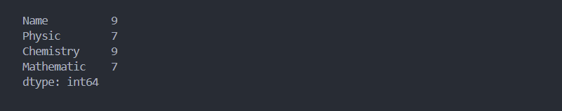

📁 [مشاهده پروژه](project/count.py)

## متد `()mean`

```python
mean(axis=_NoDefault.no_default, skipna=True, level=None, numeric_only=None, **kwargs)
```

مقدار میانگین هر ستون محاسبه می کند.

```python
import pandas as pd

try:
    df = pd.read_csv('dataset.csv')
    print(df.mean())

except Exception as err:
    print(err)
```

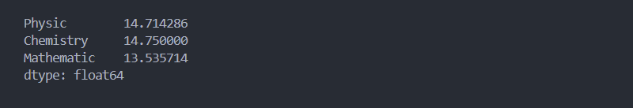

📁 [مشاهده پروژه](project/mean.py)

## متد `()std`

```python
std(axis=None, skipna=True, level=None, ddof=1, numeric_only=None, **kwargs)
```

مقدار انحراف از معیار برای هر ستون بیان می کند.

```python
import pandas as pd

try:
    df = pd.read_csv('dataset.csv')
    print(df.std())

except Exception as err:
    print(err)
```

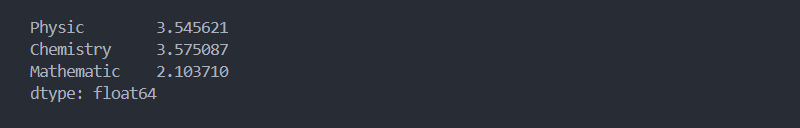

📁 [مشاهده پروژه](project/std.py)

## متد `()min`

```python
min(axis=_NoDefault.no_default, skipna=True, level=None, numeric_only=None, **kwargs)
```

حداقل مقدار entry برای هر ستون بیان می کند.

```python
import pandas as pd

try:
    df = pd.read_csv('dataset.csv')
    print(df.min())

except Exception as err:
    print(err)
```


📁 [مشاهده پروژه](project/min.py)

## متد `()median `

```python
median(axis=_NoDefault.no_default, skipna=True, level=None, numeric_only=None, **kwargs)
```

مقدار میانه برای هر ستون محاسبه می کند.

### میانه `median` چیست؟

به مقدار وسط ( صرفا براساس موقعیت ) در دسته ای از اعداد مرتب شده، میانه گفته می شود.

> 💡 دقت کنید، میانگین مقدار وسط از حاصل جمع کل مجموعه می باشد ولی میانه صرفا بیانگر مقدار عددی است که در وسط مجموعه ( صرفا موقعیت ) می باشد.

### روش محاسبه میانه `median`

برای محاسبه میانه دسته {10,3,12,16,5} به ترتیب مراحل ذیل را انجام دهید:

* اعداد به ترتیب از کوچکتر به بزرگتر مرتب کنید.

  {3,5,10,12,16}

* به موقعیت عدد وسط مجموعه میانه گفته می شود. میانه این مجموعه عدد 10 می باشد.

```python
import pandas as pd

try:
    df = pd.read_csv('dataset.csv')
    print(df.median())

except Exception as err:
    print(err)
```

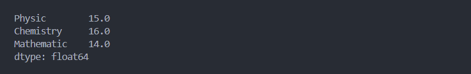

📁 [مشاهده پروژه](project/median.py)

## متد `()max`

```python
max(axis=_NoDefault.no_default, skipna=True, level=None, numeric_only=None, **kwargs)
```

حداکثر مقدار entry برای هر ستون بیان می کند.

```python
import pandas as pd

try:
    df = pd.read_csv('dataset.csv')
    print(df.max())

except Exception as err:
    print(err)
```

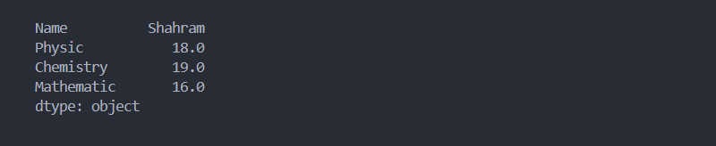

📁 [مشاهده پروژه](project/max.py)

## متد `()memory_usage`

```python
memory_usage(index=True, deep=False)
```

مقدار رم مورد استفاده برای پردازش هر ستون با واحد byte بیان می کند.

```python
import pandas as pd

try:
    df = pd.read_csv('dataset.csv')
    print(df.memory_usage())

except Exception as err:
    print(err)
```

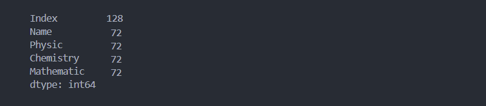

📁 [مشاهده پروژه](project/memory_usage.py)

## متد `()sum`

```python
sum(axis=None, skipna=True, level=None, numeric_only=None, min_count=0, **kwargs)
```

مجموع تمام مقادیر ستون محاسبه می کند.

```python
import pandas as pd

try:
    df = pd.read_csv('dataset.csv')
    print(df["Chemistry"].sum())

except Exception as err:
    print(err)

# Output: 132.75
```

📁 [مشاهده پروژه](project/sum.py)

## خصوصیت `shape`

تعداد سطر و ستون های دیتافریم `dataFrame` در قالب تاپل `tuple` برگشت می دهد. عدد اول بیانگر تعداد سطر و عدد دوم بیانگر تعداد ستون ها می باشد.

> 💡 دقت کنید، `shape` یک property می باشد و نه یک متد!! در نتیجه پرانتز `()` ندارد.
>
> ```
> ❌ df.shape()
> ✔️ df.shape
> ```

```python
import pandas as pd

try:
    df = pd.read_csv('dataset.csv')
    print(df.shape)

except Exception as err:
    print(err)
    
# Output: (9, 4) 

# Rows: 9
# Columns: 4
```

📁 [مشاهده پروژه](project/shape.py)

## متد `()value_counts`

```python
value_counts(subset=None, normalize=False, sort=True, ascending=False, dropna=True)
```

این متد بیانگر تعداد تکرار مقادیر مشابه می باشد.

خروجی این متد شامل ستونی با مقادیر منحصر بفرد به همراه ستونی با تعداد تکرار مقادیر ستون اول می باشد.

```python
import pandas as pd

try:
    df = pd.read_csv('dataset.csv')
    print(df["Chemistry"].value_counts())

except Exception as err:
    print(err)
```

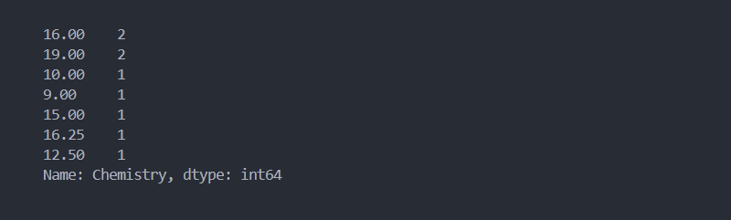

📁 [مشاهده پروژه](project/value_counts.py)

## خصوصیت `size`

تعداد داده ها یا `Entry` برگشت می دهد. برای داده های از نوع دیتافریم مقدار بازگشتی برابر `حاصل ضرب تعداد ستون در تعداد سطر می باشد`.

> 💡  دقت کنید، مقادیر NaN و تهی جزء شمارش حساب می شود.

> 💡 دقت کنید، `size` یک property می باشد و نه یک متد!! در نتیجه پرانتز `()` ندارد.
>
> ```
> ❌ df.size()
> ✔️ df.size
> ```

```python
import pandas as pd

try:
    se = pd.Series(['A', 'B', 'C'])
    print(se.size) # 3

    df = pd.read_csv('dataset.csv', na_filter=False)
    print(df)
    print(df.size) # 36

except Exception as err:
    print(err)
```

📁 [مشاهده پروژه](project/size.py)

## خصوصیت `columns`

ارایه ای از نام ستون ها برگشت می دهد.

> 💡 دقت کنید، `columns` یک property می باشد و نه یک متد!! در نتیجه پرانتز `()` ندارد.
>
> ```
> ❌ df.columns()
> ✔️ df.columns
> ```

```python
import pandas as pd

try:
    df = pd.read_csv('dataset.csv')
    print(df.columns)

except Exception as err:
    print(err)
```

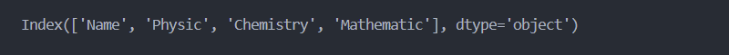

📁 [مشاهده پروژه](project/columns.py)

## خصوصیت  `index`

شماره ایندکس آغازین و پایانی به همراه میزان رشد ایندکس `step` در هر سطر بیان می کند.

> 💡 دقت کنید، `index` یک property می باشد و نه یک متد!! در نتیجه پرانتز `()` ندارد.
>
> ```
> ❌ df.index()
> ✔️ df.index
> ```

```python
import pandas as pd

try:
    df = pd.read_csv('dataset.csv')
    print(df.index)

except Exception as err:
    print(err)
```


📁 [مشاهده پروژه](project/index.py)

## خصوصیت `empty`

بیانگر وجود / عدم وجود مقدار تهی در سری یا دیتافریم می باشد. **مقدار برگشتی این متد `bool` می باشد.**

> 💡 دقت کنید، `empty` یک property می باشد و نه یک متد!! در نتیجه پرانتز `()` ندارد
>
> ```
> ❌ df.empty()
> ✔️ df.empty
> ```

```python
import pandas as pd

try:
    df = pd.DataFrame({
        'Name': []
    })
    print(df.info())
    print(df.empty)

except Exception as err:
    print(err)
```


📁 [مشاهده پروژه](project/empty.py)

## متد `()idxmax`

```python
idxmax(axis=0, skipna=True, numeric_only=False)
```

شماره **ایندکس یا نام لیبل** سطری که دارای بالاترین مقدار می باشد برگشت می دهد.

> 💡 دقت کنید، در صورتیکه چند سطر دارای بیشترین مقدار باشند، اولین سطر برگشت داده می شود.

به صورت پیش فرض متد `()idxmax` مقادیر NA در نظر نمی گیرد برای غیر فعال کردن این پیش فرض کافیست پارامتر `skipna ` برابر `False` قرار دهید.

```python
import pandas as pd

try:
    df = pd.read_csv('dataset.csv')
    print(df["Chemistry"].idxmax()  # 5

except Exception as err:
    print(err)

print("-----")

series = pd.Series(data=[10, None, 12, 13, 14])
print(series.idxmax())  # 2
print(series.idxmax(skipna=False))  # nan
```

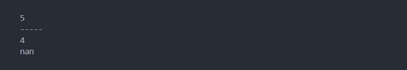

📁 [مشاهده پروژه](project/idxmax.py)

## متد `()idxmin`

```python
idxmin(axis=0, skipna=True, numeric_only=False)
```

شماره **ایندکس یا نام لیبل** سطری که دارای کم ترین مقدار می باشد برگشت می دهد.

```python
import pandas as pd

try:
    df = pd.read_csv('dataset.csv')
    print(df["Chemistry"].idxmin())  # 5

except Exception as err:
    print(err)

print("-----")

series = pd.Series(data=[10, None, 12, 13, 14])
print(series.idxmin())  # 2
print(series.idxmin(skipna=False))  # nan
```

> 💡 دقت کنید، در صورتیکه چند سطر دارای کم ترین مقدار باشند، اولین سطر برگشت داده می شود.

به صورت پیش فرض متد `()idxmin` مقادیر NA در نظر نمی گیرد برای غیر فعال کردن این پیش فرض کافیست پارامتر `skipna ` برابر `False` قرار دهید.

```python
import pandas as pd

try:
    df = pd.read_csv('dataset.csv')
    print(df["Chemistry"].idxmin())  # 5

except Exception as err:
    print(err)

print("-----")

series = pd.Series(data=[10, None, 12, 13, 14])
print(series.idxmin())  # 2
print(series.idxmin(skipna=False))  # nan
```

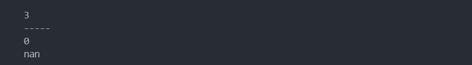

📁 [مشاهده پروژه](project/idxmin.py)

## خصوصیت `loc`

این متد بازه ای مشخص از داده ها را با دریافت ارایه ای از **نام لیبل ها** ( به صورت پیش فرض نام هر لیبل برابر شماره ایندکس می باشد ) برگشت می دهد.

> 💡 دقت کنید، `loc` یک property می باشد و نه یک متد!! در نتیجه پرانتز `()` ندارد.
>
> ```
> ❌ df.loc()
> ✔️ df.loc
> ```

```python
import pandas as pd

try:
    df = pd.read_csv('dataset.csv')
    print(df.loc[0:2])

except Exception as err:
    print(err)
```

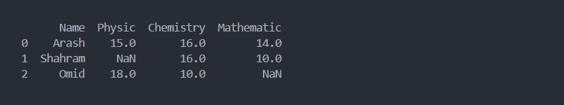

📁 [مشاهده پروژه](project/loc.py)

## خصوصیت `iloc`

این متد بازه ای  مشخص از داده ها را با دریافت ارایه ای از **شماره ایندکس** برگشت می دهد.

> 💡 دقت کنید، `iloc` یک property می باشد و نه یک متد!! در نتیجه پرانتز `()` ندارد.
>
> ```
> ❌ df.iloc()
> ✔️ df.iloc
> ```

```python
import pandas as pd

try:
    df = pd.read_csv('dataset.csv')
    print(df.iloc[0:2])

except Exception as err:
    print(err)
```

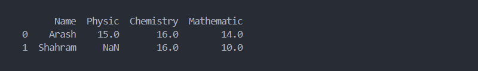

📁 [مشاهده پروژه](project/iloc.py)

## خصوصیت  `at`

مقدار یک داده را در موقعیت مشخصی براساس **نام لیبل** برگشت می دهد.

> 💡 دقت کنید، `at` یک property می باشد و نه یک متد!! در نتیجه پرانتز `()` ندارد.
>
> ```
> ❌ df.at()
> ✔️ df.at
> ```

```python
import pandas as pd

try:
    df = pd.read_csv('dataset.csv')
    print(df.at[1, 'Name'])

except Exception as err:
    print(err)

# Outpu: Shahram
```

📁 [مشاهده پروژه](project/at.py)

## خصوصیت  `iat`

مقدار یک داده را در موقعیت مشخصی براساس **شماره ایندکس** برگشت می دهد.

> 💡 دقت کنید، `iat` یک property می باشد و نه یک متد!! در نتیجه پرانتز `()` ندارد.
>
> ```
> ❌ df.iat()
> ✔️ df.iat
> ```

```python
import pandas as pd

try:
    df = pd.read_csv('dataset.csv')
    print(df.iat[1, 0])

except Exception as err:
    print(err)

# Output: Shahram
```

📁 [مشاهده پروژه](project/iat.py)

## متد `()sort_values`

```python
sort_values(by, *, axis=0, ascending=True, inplace=False, kind='quicksort', na_position='last', ignore_index=False, key=None)
```

به صورت پیش فرض داده ها بر اساس شماره `index` مرتب شده، برای تغییر این ترتیب با توجه به ستون مشخص شده از این متد استفاده می شود.

* پارامتر ascending: اگر این پارامتر برابر `False` باشد ترتیب نزولی خواهد بود. به صورت پیش فرض `True` می باشد.
* پارامتر inplace: اگر این پارامتر برابر `True` باشد تغییرات روی داده اصلی ذخیره خواهد شد. به صورت پیش فرض `False` می باشد.

```python
import pandas as pd

try:
    df = pd.read_csv('dataset.csv')
    df.sort_values(['Mathematic'], ascending=False, inplace=True)
    print(df)

except Exception as err:
    print(err)
```

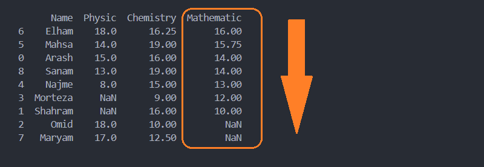

📁 [مشاهده پروژه](project/sort_values.py)

## متد `()isnull`

```python
isnull(obj)
```

در صورتیکه هر `Entry` برابر `missing-value` باشد مقدار `True` برگشت می دهد.

> 💡 این متد معادل متد `()isna` می باشد.

```python
import pandas as pd

try:
    df = pd.read_csv('dataset.csv')
    print(df.isnull())

except Exception as err:
    print(err)
```

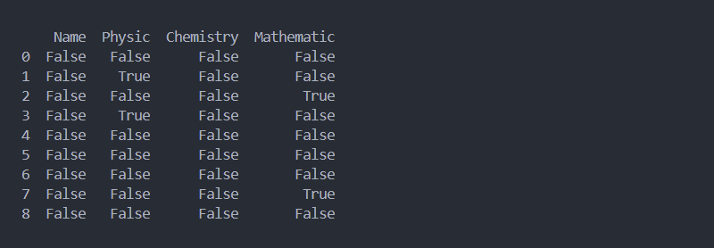

📁 [مشاهده پروژه](project/isnull.py)

## متد `()notnull`

```python
notnull(obj)
```

در صورتیکه هر `Entry` برابر `missing-value` **نباشد** مقدار `True` برگشت می دهد. دقیقا مخالف متد `()isnull` عمل می کند.

> 💡 این متد معادل متد `()notna` می باشد.

```python
import pandas as pd

try:
    df = pd.read_csv('dataset.csv')
    print(df.notnull())

except Exception as err:
    print(err)
```

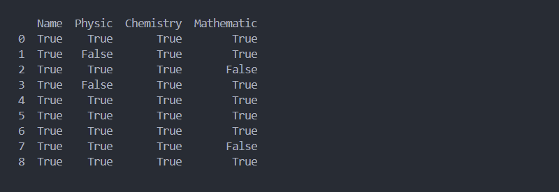

📁 [مشاهده پروژه](project/notnull.py)

## متد `()isna`

در صورتیکه هر `Entry` برابر `missing-value` باشد مقدار `True` برگشت می دهد.

> 💡 این متد معادل متد `()isnull` می باشد.

```python
import pandas as pd

try:
    df = pd.read_csv('dataset.csv')
    print(df.isna())

except Exception as err:
    print(err)
```

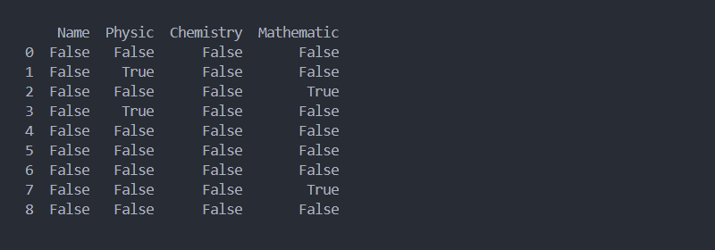

📁 [مشاهده پروژه](project/isna.py)

## متد `()notna`

در صورتیکه هر `Entry` برابر `missing-value` **نباشد** مقدار `True` برگشت می دهد. دقیقا مخالف متد `()isna` عمل می کند.

> 💡 این متد معادل متد `()notnull` می باشد.

```python
import pandas as pd

try:
    df = pd.read_csv('dataset.csv')
    print(df.notna())

except Exception as err:
    print(err)
```

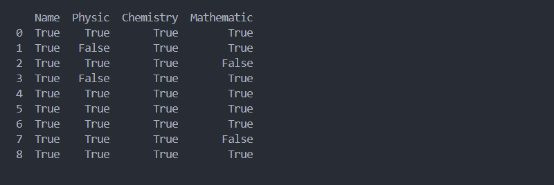

📁 [مشاهده پروژه](project/notna.py)
