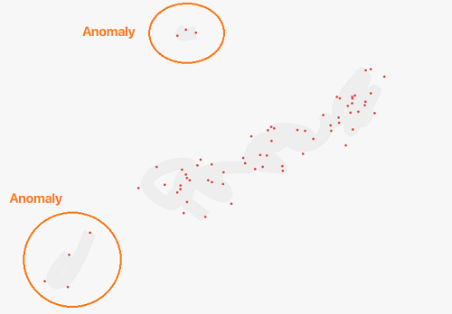
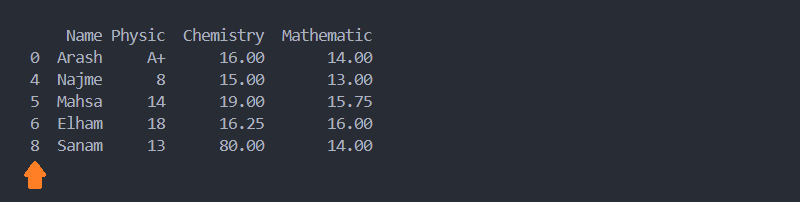
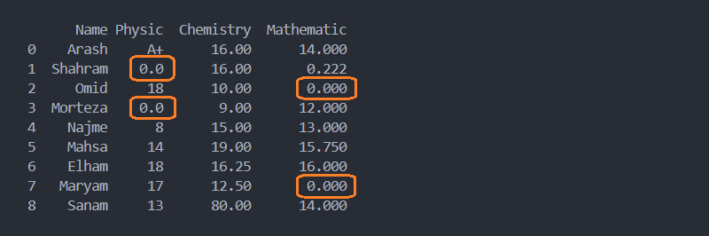

# فصل 5. پاکسازی داده `Data Cleaning`

گام بعدی در داده کاوی، پاکسازی داده `DataSet` از داده هایی که شرایط ذیل داشته باشند:

* داده هایی که انحراف زیادی با سایر داده ها دارند `Data Anomaly`
* داده های تهی `NaN / Missing data` 
* داده های غلط
* داده هایی با فرمت اشتباه
* داده های مشابه ( به شرط اینکه تشابه داده وجود اشکال شود )
* داده های کم ارزش یا بی ارزش

> پاکسازی داده به معنی حذف داده ها نیست بلکه در این مرحله باید تصمیم گیری کنید که اون دسته از داده ها حذف شوند یا با مقدار جدیدی جایگذاری شوند و این تصمیم گیری وابسته به میزان انتظار شما در دقت یادگیری ماشین و میزان مصرف منابع سیستم می باشد.

## ناهنجاری داده `Data Anomaly`



به داده هایی که از آهنگ تغییرات سایر داده ها **بدون دلیل منطقی** پیروی می کند و اختلاف این داده ها با سایر داده ها زیاد می باشد، به این دسته از داده ها، داده های ناهنجار `Data Anomaly` گفته می شود.

برای مثال دیتاست سال ساخت ماشین در اختیار داریم در این داده چند ماشین وجود دارد که برای سال 100 سال پیش است در حالیکه بازه سایر ماشین برای 10 سال اخیر می باشد.

## متد `()dropna`

```python
dropna(*, axis=0, how=_NoDefault.no_default, thresh=_NoDefault.no_default, subset=None, inplace=False)
```

این متد سطرهایی که شامل سلول های خالی `NaN` می باشند، حذف می کند.

* **پارامتر inplace**: اگر `True` باشد تغییرات روی داده اصلی ذخیره می شود. به صورت پیش فرض `False` می باشد.
* **پارامتر  axis**: اگر برابر 1 باشد به جای حذف سطر، ستونی که شامل سلول خالی باشد حذف می کند. به صورت پیش فرض `0` می باشد.

```python
import pandas as pd

try:
    df = pd.read_csv('dataset.csv')
    df.dropna(inplace=True)
    print(df)

except Exception as err:
    print(err)
```



> از روی شماره ایندکس می توانید به سطرهای حذف شده پی ببرید.

📁 [مشاهده پروژه](project/dropna.py)

## متد `()fillna`

```python
fillna(value=None, *, method=None, axis=None, inplace=False, limit=None, downcast=None)
```

سلول های خالی `NaN/Na` با مقدار تعریف شده جایگزین می کند.

* **پارامتر inplace**: اگر `True` باشد تغییرات روی داده اصلی ذخیره می شود. به صورت پیش فرض `False` می باشد.
* **پارامتر  axis**: اگر برابر 1 باشد به جای حذف سطر، ستونی که شامل سلول خالی باشد حذف می کند. به صورت پیش فرض `0` می باشد.

<ul dir="rtl" align="right">
	<li>
		<p dir="rtl">
			<strong>
				پارامتر method
			</strong>
			:
		</p>
		<ul dir="rtl" align="right">
			<li>
				<p dir="rtl">
					backfill / bfill: مقادیر خالی را با مقدار سطر یا ستون (در صورتیکه axis برابر  1 یا 'columns' باشد)
					<strong>
					بعدی
					</strong>
					جایگزین می کند.
				</p>
			</li>
			<li>
				<p dir="rtl">
					pad / ffill: مقادیر خالی را با مقدار سطر یا ستون (در صورتیکه axis برابر  1 یا 'columns' باشد)
					<strong>
					قبلی
					</strong>
					جایگزین می کند.
				</p>
			</li>
			<li>
				<p dir="rtl">
					none
				</p>
			</li>
		</ul>
	</li>
</ul>

```python
import pandas as pd

try:
    df = pd.read_csv('dataset.csv')
    df.fillna(0.0, inplace=True)
    print(df)

except Exception as err:
    print(err)
```



📁 [مشاهده پروژه](project/fillna.py)

## متد `()backfill`

```python
DataFrame.backfill(*, axis=None, inplace=False, limit=None, downcast=None)
```

مقادیر خالی را با مقدار سطر یا ستون (در صورتیکه axis برابر  1 یا 'columns' باشد) **بعدی** جایگزین می کند.

> 💡 این متد عملکردی مشابه متد ` (method = ['bifll', 'backfill'])DataFrame.fillna` دارد.

## متد `()bfill`

```python
DataFrame.bfill(*, axis=None, inplace=False, limit=None, downcast=None)
```

مقادیر خالی را با مقدار سطر یا ستون (در صورتیکه axis برابر  1 یا 'columns' باشد) **بعدی** جایگزین می کند.

>💡 این متد عملکردی مشابه متد ` (method = ['bifll', 'backfill'])DataFrame.fillna` دارد.

## متد `()pad`

```python
DataFrame.pad(*, axis=None, inplace=False, limit=None, downcast=None)
```

مقادیر خالی را با مقدار سطر یا ستون (در صورتیکه axis برابر  1 یا 'columns' باشد) **قبلی** جایگزین می کند.

> 💡 این متد عملکردی مشابه متد ` (method = ['pad', 'ffill'])DataFrame.fillna` دارد.

## متد `()ffill`

```python
DataFrame.ffill(*, axis=None, inplace=False, limit=None, downcast=None)
```

مقادیر خالی را با مقدار سطر یا ستون (در صورتیکه axis برابر  1 یا 'columns' باشد) **قبلی** جایگزین می کند.

💡 این متد عملکردی مشابه متد ` (method = ['pad', 'ffill'])DataFrame.fillna` دارد.
