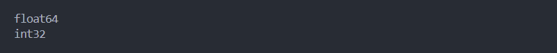
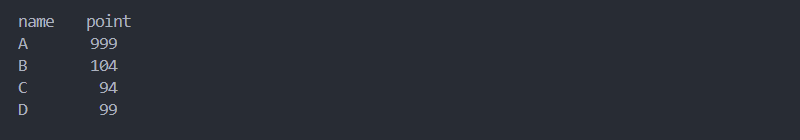

# فصل 6. تغییرات داده `Data Manipulation`

## متد `()astype`

```python
astype(dtype, copy=True, errors='raise')
```

این متد برای تغییر جنس کل یا ستون مشخصی از دیتافریم / سری استفاده می شود.

* **پارامتر dtype**: جنس موردنظر برای تغییر دریافت می کند که باید در قالب `Dict` مقدار دهی کنیم.
* **پارامتر copy**: اگر برابر `False ` باشد تغییرات جدید روی اصل داده اعمال می شود. به صورت پیش فرض مقدار `True` می باشد.

```python
import pandas as pd

try:
    df = pd.read_csv('dataset.csv')

    print(df['Chemistry'].dtypes)
    df = df.astype({
        'Chemistry': 'int32'
    })
    print(df['Chemistry'].dtypes)

except Exception as err:
    print(err)
```



📁 [مشاهده پروژه](project/astype.py)

## متد `()groupby`

```python
groupby(by=None, axis=0, level=None, as_index=True, sort=True, group_keys=_NoDefault.no_default, squeeze=_NoDefault.no_default, observed=False, dropna=True)
```

برای دسته بندی داده های مشابه و اعمال تابع از متد `()groupby` استفاده می شود.

<ul dir="rtl" align="right">
	<li>
		<p>
			<strong>
			پارامتر by
			</strong>:
			نام ستون موردنظر برای اعمال گروه بندی برای این پارامتر تعریف می شود.
		</p>
	</li>
	<li>
		<p>
			<strong>
			پارامتر sort
			</strong>:
			اگر برابر
			<code>False</code>
			باشد مرتب سازی اعمال نمی شود. به صورت پیش فرض برابر
			<code>True</code>
			می باشد و مرتب سازی نزولی می باشد. 
		</p>
		<blockquote>
		💡 توصیه می شود برای افزایش سرعت پردازش، مقدار این پارامتر برابر
		<code>False</code>
		تعریف شود.
		</blockquote>
	</li>
</ul>

این مثال: 

مرحله اول: ستون `name` را براساس مقادیر مشابه، به 4 دسته تقسیم می کند.

مرحله دوم: عمل میانگین `()mean` را به مقادیر هر 4 دسته اعمال می کند. `از هر متد دیگری می توان استفاده کرد`

در نتیجه جدولی با مقادیر منحصر به فرد `name` به همراه مقدار میانگین اعضای مربوط به آن دسته ایجاد می شود.

```python
import pandas as pd

data = {
    'point': [999, 90, 99, 104, 105, 94, 99, 104],
    'name': ['A', 'B', 'B', 'B', 'A', 'C', 'D', 'B']
}
df = pd.DataFrame(data)
print(df.groupby(['name']).mean())
```



📁 [مشاهده پروژه](project/groupby.py)

